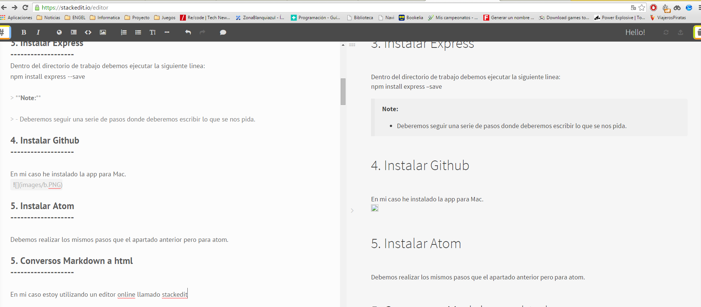

Sistemas y Tecnologias Web
===================

Pasos a seguir:
-------------

1. Darse de alta en comunidad Google+
-------------------

```flow
st=>start: Unirse a comunidad google+
e=>end
op=>operation: introducir datos
cond=>condition: login ull.edu.es?

st->op->cond
cond(yes)->e
cond(no)->op
```

> **Note:**

> - Es requisito indispensable tener un correo de la universidad de la laguna


2. Instalar node.JS
-------------------
Para ello iremos a la pagina oficial y descaremos el archivo dmg que instalaremos en mi caso en la version Mac Os X.


*npm funciona correctamente.


3. Instalar Express
-------------------
Dentro del directorio de trabajo debemos ejecutar la siguiente linea:
npm install express --save

> **Note:**

> - Deberemos seguir una serie de pasos donde deberemos escribir lo que se nos pida.

4. Instalar Github
-------------------

En mi caso he instalado la app para Mac.


5. Instalar Atom
-------------------

Debemos realizar los mismos pasos que el apartado anterior pero para atom.

5. Conversos Markdown a html
-------------------

En mi caso estoy utilizando un editor online llamado stackedit


